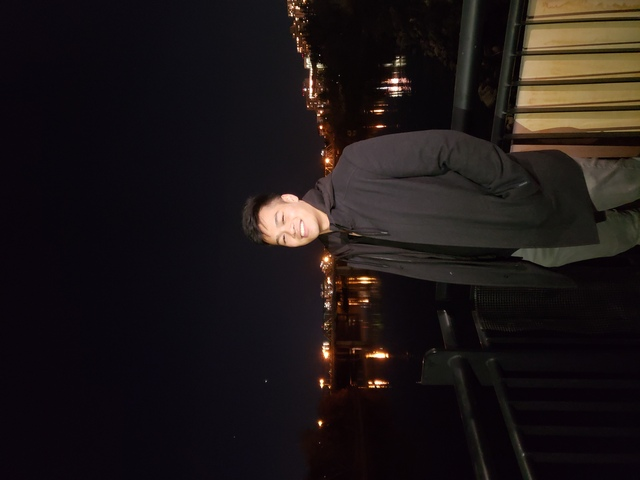

# Hey! I'm David Cao (dave-cao)

I am a 4th year student at the University of Alberta studying a Bachelors of Science in Kinesiology as well as an aspiring progammer!

## My Interests

I would like to say that I'm a man with many interests and hobbies. If something seems interesting, I won't hesitate to try it out!

### Health and Kinesiology 🏃‍♂️

I love the intracies of health and movement. Anything related to anatomy, and biomechanics gets me super excited. I like the practical application of helping other people with their body be it personal training, exercise programs, or problem solving a particular problem they were having (eg: Rhomboid minor pain caused by Serratus Anterior weakness)

### Coding 👨‍💻

Believe or not, but I love to problem solve. When there is a bug in my code, I get frustrated but also oddly excited. It's at weird type of feeling. I wll say though, programming doesn't get fun until you are able to automate or bring out ideas in your mind to real life!

Believe me, when I took 2 hours to program something that would save me at most 3 seconds of my day...it was one of the most beautiful moments of my life...

### Singing 🎤

One of the things that I would consider a guilty pleasure. I joined my University without telling anyone, and it was an exhilarating experience. The congregation of hundreds of voices coming together to produce a captivating and beautiful sound. I can't really describe it in words.

I believe that music is a universal language. You can go anywhere, speak to someone else with your song, and they would be able to understand it. It get's past language barriers of the mind as well as emotional barriers of the heart.

### Weightlifting 🏋️

Weight lifting holds a pedestal in my heart. It was what brought me up in the most gloomiest of times. Gave me friends that I would keep for a lifetime. Oh, and it also got me jacked.

### Learning 🤓

Alright, this may be a bit cliche but it has to be said. I have a love and hate relationship with learning new things. It's a pain starting out but the long term benefits are amazing. Everything is transferable.

When I first started to learn how to code, I wondered...how will this help me with my career in Kinesiology? I still have to get back to you on that one.

However, it did make me discover that there is always a world within a world. There's always something else to explore out there. The possibilities are endless. If you put in the hardwork and dedication, anything is possible.

---

## What I'm Currently Learning

### Coding

-   Python (taking an introductory course in school)
-   Javascript (furthering my knowledge though algorithms in _exercism.io_)
-   Bash (I'm daily driving Linux. I have no inch of Windows anywhere. I'm kinda forced to learn this)
-   React (continuing on in the freeCodeCamp.com bootcamp; my next project will be based off of React)

### Kinesiology

-   Advanced Injury Management (a course I'm taking in school - basically become a Physio)

### Language

-   Spanish (everyday without fail, currently on a 117 day streak in Duolingo and counting)

### Other

-   KSR Case Competition (learning how to work in a team, reach out to organizations, and present in front of judges)
-   VIM (I love it, it's a way of life)

---

## Collaboration

Honestly I have no clue what I want to collaberate on. However I am open to new ideas, suggestions, or just a hello!

---

## How to Reach Me

You can reach me by visiting my website at https://davidcao.me/ and filling out the form!

---

<!---
dave-cao/dave-cao is a ✨ special ✨ repository because its `README.md` (this file) appears on your GitHub profile.

You can click the Preview link to take a look at your changes.
--->
